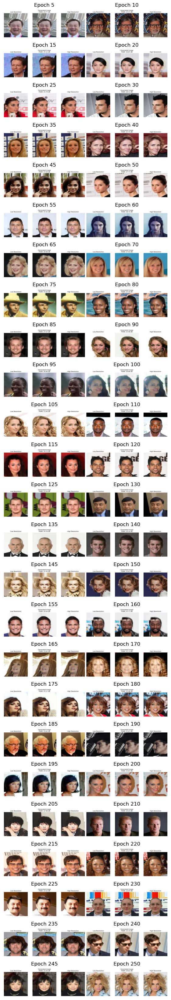

# SRGAN Notebook Implementation

## Overview

This repository contains a Jupyter Notebook implementation of the Super-Resolution Generative Adversarial Network (SRGAN). SRGAN enhances image resolution using deep learning techniques. The repository includes the trained SRGAN model checkpoint and images saved at various stages during training.

## Features

- **Image Super-Resolution**: Converts low-resolution images to high-resolution outputs.
- **Generative Adversarial Network (GAN)**: Utilizes GAN architecture to refine image details.
- **Training Visualization**: Displays images saved every 5 epochs during training to monitor progress.

## Generator and Discriminator

### Generator

The Generator is a neural network that creates high-resolution images from low-resolution inputs. Its primary goal is to generate images that closely resemble the high-resolution ground truth. The Generator is designed to capture and enhance fine details, producing outputs that appear realistic.

In SRGAN, the Generator typically includes several convolutional layers, residual blocks, and upsampling layers. One key component of the Generator is the **Pixel Shuffle** operation. Pixel Shuffle, also known as depth-to-space, is used to upscale the resolution of the image efficiently. It rearranges the pixels from a high-dimensional space into a higher-resolution image, allowing the network to generate sharper and more detailed images.

### Discriminator

The Discriminator is another neural network that evaluates the authenticity of the images produced by the Generator. Its role is to distinguish between real high-resolution images from the CelebA dataset and the fake high-resolution images generated by the Generator. The Discriminator provides feedback to the Generator about the quality of the generated images.

In SRGAN, the Discriminator consists of several convolutional layers that progressively reduce the image size while increasing the depth of the feature maps. It is trained to classify images as either "real" or "fake" based on their authenticity. The Discriminator's feedback helps the Generator improve by providing gradients that indicate how the Generator's outputs can be enhanced.

### Training Process

The Generator and Discriminator are trained simultaneously in a competitive setting. The Generator tries to produce images that can deceive the Discriminator, while the Discriminator aims to correctly identify real versus generated images. This adversarial process continues until the Generator produces high-resolution images that are indistinguishable from real ones by the Discriminator.

This adversarial setup helps both networks improve: the Generator becomes better at producing realistic images, and the Discriminator becomes better at distinguishing between real and fake images. Achieving a balance between the two networks is crucial for producing high-quality image super-resolution.

## Requirements

To run the notebook and use the SRGAN model, you need the following packages:

- Jupyter Notebook
- TensorFlow
- NumPy
- Matplotlib
- PIL (Python Imaging Library)

## Training

The SRGAN model was trained on the CelebA dataset for 250 epochs. Images were saved every 5 epochs to track the model’s progress.

## Repository Files

- **Model Checkpoint**: `srgan_model_checkpoint.h5`  
  Contains the trained SRGAN model checkpoint after 250 epochs.

- **Training Images**: `training_images_epoch_*.png`  
  Images saved every 5 epochs during training. Each file shows the state of the model at the corresponding epoch (e.g., `training_images_epoch_5.png`).

## Visualizing the Output

### Load and Display Training Images

View the images saved at every 5 epochs to observe the model's development. You can use your preferred image viewer or include code in the notebook to display them.

### Generate High-Resolution Images

Use the trained SRGAN model to enhance low-resolution images. Detailed instructions for loading the model and generating images are provided in the notebook.

